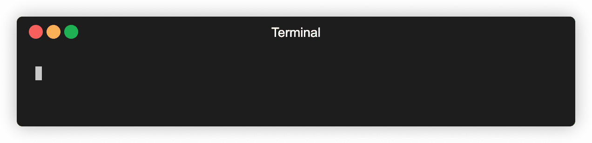

# tiktok-playwright [](https://github.com/arc298/tiktok-playwright/actions)  [](https://app.codecov.io/gh/arc298/tiktok-playwright) [](https://www.npmjs.com/package/tiktok-playwright)

> An application for downloading a TikTok user's videos. Use responsibly.



## Install

```bash
npm i -g tiktok-playright
```

## Usage

To download a user's video, specify the user with or without the @ prefix:
```bash
tiktok-playright <user>
```
By default, videos will be downloaded to a directory named after the user under the current working directory.


## Command-line
```bash
$ tiktok-playwright --help

Usage: tiktok-playwright <user> [options]

Options:
  --version            Show version number             
  --downloadDir, -d    Download destination            [default: "./<user>"]
  --redownload,  -r    Re-downloads existing files     [default: false]
  --quiet,       -q    Disables message output         [default: false]
  --help               Show help                       

Examples:
  tiktok-playwright user
  tiktok-playwright user -d /path/to/download
  tiktok-playwright user -d /path/to/download -q
  tiktok-playwright @user -d /path/to/download --quiet --redownload
```

## API

### class: TikTokPlaywright()

Download's TikTok user videos.

#### .download(user[, options])

- `user`  **[String](https://developer.mozilla.org/en-US/docs/Web/JavaScript/Reference/Global_Objects/String)**
- `options`  **[Object](https://developer.mozilla.org/docs/Web/JavaScript/Reference/Global_Objects/Object)**  (optional)
    - `downloadDir` **[String](https://developer.mozilla.org/en-US/docs/Web/JavaScript/Reference/Global_Objects/String)** download destination (default: `./<user>`)
    - `redownload` **[Boolean](https://developer.mozilla.org/en-US/docs/Web/JavaScript/Reference/Global_Objects/Boolean)** re-downloads existing files  (default: `false`)
    - `quiet` **[Boolean](https://developer.mozilla.org/en-US/docs/Web/JavaScript/Reference/Global_Objects/Boolean)** disables message output (default: `true`)

Downloads the specified user's videos.
If successful, a resolved promise is returned.
Otherwise, a rejected promise is returned.


## Changelog
<details>
 <summary><strong>Changelog</strong></summary>

##### Latest

##### `0.0.5`

- Initial version

</details>

## Contributing
Pull requests are welcome. For major changes, please open an issue first to discuss what you would like to change.

- Fork it (https://github.com/arc298/tiktok-playwright/fork)
- Create your feature branch (git checkout -b my-new-feature)
- Please make sure to update tests as appropriate.
- Commit your changes (git commit -am 'Add new feature')
- Push the branch (git push origin my-new-feature)
- Create a new Pull Request

## License
MIT License

Copyright (c) 2021

Permission is hereby granted, free of charge, to any person obtaining a copy
of this software and associated documentation files (the "Software"), to deal
in the Software without restriction, including without limitation the rights
to use, copy, modify, merge, publish, distribute, sublicense, and/or sell
copies of the Software, and to permit persons to whom the Software is
furnished to do so, subject to the following conditions:

The above copyright notice and this permission notice shall be included in all
copies or substantial portions of the Software.

THE SOFTWARE IS PROVIDED "AS IS", WITHOUT WARRANTY OF ANY KIND, EXPRESS OR
IMPLIED, INCLUDING BUT NOT LIMITED TO THE WARRANTIES OF MERCHANTABILITY,
FITNESS FOR A PARTICULAR PURPOSE AND NONINFRINGEMENT. IN NO EVENT SHALL THE
AUTHORS OR COPYRIGHT HOLDERS BE LIABLE FOR ANY CLAIM, DAMAGES OR OTHER
LIABILITY, WHETHER IN AN ACTION OF CONTRACT, TORT OR OTHERWISE, ARISING FROM,
OUT OF OR IN CONNECTION WITH THE SOFTWARE OR THE USE OR OTHER DEALINGS IN THE
SOFTWARE._
